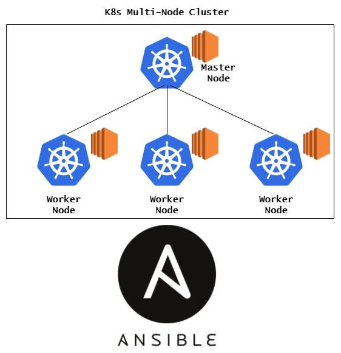

# This configuration is focused on the configuration of the k8s multinode cluster using ansible on AWS, AWS Instances will be launched first by ansible, Then we will configure k8s multinode cluster on those nodes.

### We are going to use Red Hat Enterprise Linux 9 (HVM), SSD Volume Type -- Free Tier Eligible
Configure the ansible inventory file, and ansible.cfg file with the necessary details and then we are good to go.

*** Follow the below steps ***

- Copy your private key file as `key.pem` file in the controller node as it will be used later to login to the upcoming target node.
- To create ansible-vault -> `ansible-vault create aws_credential.yml` 
- Add your aws credentials in `aws_credential.yml` file.
- ansible-galaxy collection install community.general //to install modprobe module
- ansible-galaxy collection install community.aws
- Change your subnet name and other details in `instance_vars.yml`
- Run - `ansible-playbook create_instance.yml` It will create 3 EC2 instances, And it will also update the inventory file dynamically with the instance details.
- Run - `ansible-playbook rhel_common.yaml` It will configure the k8s master and slave node with common configurations.
- Make Sure in `rhel_common.yaml` you change the `crio` download URL, It will keep getting updated in daily basics, get the latest URL from here - https://download.opensuse.org/repositories/isv:/kubernetes:/addons:/cri-o:/prerelease:/v1.29:/build/rpm/x86_64/
- Run - `ansible-playbook rhel_master.yaml` It will configure k8s master node and it will also join the slave node to the master node.
- Now login to K8s master node , and create usual pods/deployments.
