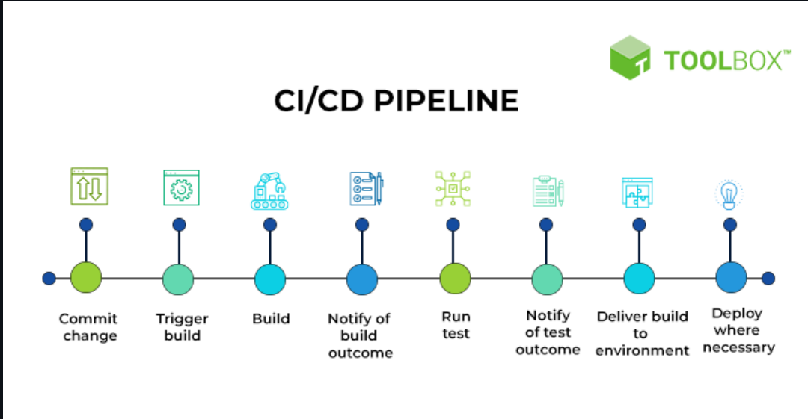
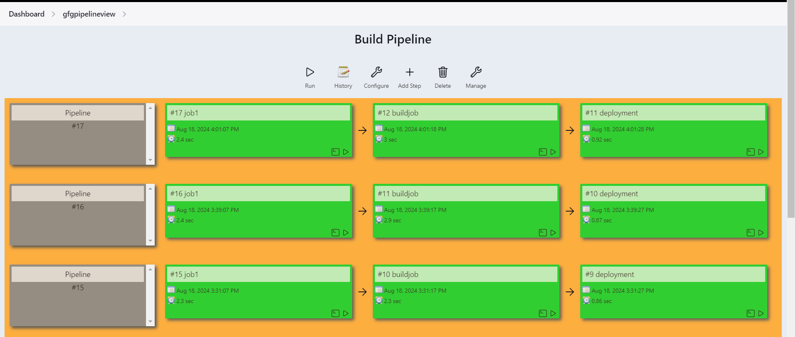

### Jenkins


### What is CI/CD?

- CI/CD stands for Continuous Integration and Continuous Delivery/Deployment.


- Continuous Integration is the practice of merging code changes into a central repository several times a day. It is used to detect bugs early in the development cycle.
- Continuous Delivery is the practice of deploying code changes into a production environment. It is used to deliver code changes to the users.

**CI/CD Process Example**


Developer commit code in GitHub -> Pull the code from GitHub -> Build the code -> Test the code -> Deploy the code to the Dev environment -> Test the code in the Dev environment -> Deploy the code to the QA environment -> Test the code in the QA environment -> Deploy the code to the Production environment

### What is Jenkins?

- Jenkins is an open-source automation tool written in Java. It is used to automate the CI/CD process.

**Jenkins Installation**

- Install Java
- Install Libraries
- Install Jenkins

**After installing Jenkins, Follow the below steps:**

- Now Jenkins is installed and running on port 8080. To access Jenkins, open the following URL in a browser.
```
http://<ec2-instance-public-ip>:8080
```
- To get the initial admin password, run the following command.
```
sudo cat /var/lib/jenkins/secrets/initialAdminPassword
```


- Install the suggested plugins.


- Create an admin user.


- Jenkins is now ready to use.


### Jenkins Terminologies

- **Jenkins Job** - What work you want to do in Jenkins is called a Jenkins Job. It can be a build job, a test job, a deployment job, etc.

- **Jenkins Pipeline** - A Jenkins Pipeline is a collection of Jenkins Jobs. It is used to organize Jenkins Jobs into stages.

- **Master** - The Jenkins Master is the main Jenkins server. It is responsible for managing the Jenkins Jobs and the Jenkins Agents.

- **Worker/Agent** - The Jenkins Worker/Agent is a machine that is responsible for running Jenkins Jobs. It is connected to the Jenkins Master.


- Launch Jenkins Server On Docker- `docker run -p 8080:8080 -p 50000:50000 -dit --name jenkins --restart=on-failure -v jenkins_home:/var/jenkins_home jenkins/jenkins:lts-jdk17`

### Steps to Configure Jenkins Slave

- Launch an EC2 Instance with `t2.medium` Instance Type(We will configure it as our Jenkins Agent/Slave node)

- Run the below Command to download java JDK
`wget https://download.oracle.com/java/17/archive/jdk-17.0.10_linux-x64_bin.rpm`
`yum install jdk-17.0.10_linux-x64_bin.rpm -y`

- Start the agent and join it to the Jenkins Master Node(You will get the below commands, from Jenkins master while adding this node, Don't use the below one, They are for my server)

`curl -sO http://54.146.158.246:8080/jnlpJars/agent.jar`
`java -jar agent.jar -jnlpUrl http://54.146.158.246:8080/computer/ec2/jenkins-agent.jnlp -secret 557af3ada1a128916ce4cac68d93ce7eb1b6d5e186ac18f43972697165a9f0d8 -workDir "/" &`

### Jenkins Server

- My Python Flask App Repository used for demonstration(Snake Game)[https://github.com/sudhanshuvlog/SnakeGame.git]

- Create Cron Schedule Expression - https://crontab.guru/

- DevOps First CI-CD Pipeline 

- *Jenkinsfile* - A Jenkinsfile is a text file that contains the definition of a Jenkins Pipeline. It is written using the Groovy DSL (Domain-Specific Language) and is used to define the entire build process, including stages, steps, and other configurations. This approach provides consistency, repeatability, and easy collaboration in the software development and deployment process. A sample pipeline with name `jenkinsfile` is present in this repo.

## GitHub Actions

Seamless Integration:
GitHub Actions seamlessly integrates with your GitHub repositories, allowing you to define workflows directly within your codebase.

No Infrastructure Management:
There's no need to manage infrastructure like EC2 instances or Jenkins servers. GitHub handles the underlying infrastructure, simplifying the setup process.

Easy Configuration:
Workflows are defined using YAML files within your repository, making it easy to version control and collaborate on CI/CD configurations.

Event-Driven Triggers:
GitHub Actions triggers workflows based on various events such as pushes, pull requests, issue comments, and more, ensuring your CI/CD pipeline responds dynamically to repository changes.

### GitHub Actions Workflow

- **Workflow** A GitHub Actions Workflow is an automated process designed to handle tasks such as building, testing, packaging, releasing, or deploying projects within your repository.
- We have to create .github/workflows directory in our repository and we have to write the workflow in a file called `YAML` file.
- Utilize triggers to initiate the Workflow. Triggers can include events such as pushes, pull requests, comments, or custom events based on your project's requirements.

### Example of GitHub Actions Workflow

```yaml
name: CI
on:
  push:
    branches: [ main ]
  pull_request:
    branches: [ main ]
jobs:
    build:
        runs-on: ubuntu-latest
    
        steps:
        - uses: xxxxxxxxxxxxxxxx@xx
        - name: Set up JDK 11
        uses: xxxxxxxxxxxxxxxxxx@xx
        with:
            java-version: '11'
        - name: Build with Maven
        run: mvn -B package --file pom.xml
```


### GitHub Actions Hosted Runners

- **GitHub Actions Hosted Runners** are virtual machines that are hosted by GitHub.
- We can use the GitHub Actions Hosted Runners to run our CI/CD pipeline.
- It's just like using Jenkins with EC2 instances (slave nodes).

We can always refer to the [official documentation](https://docs.github.com/en/actions) for more information.<br>

You can use this link to use already created codes for GitHub Actions: https://github.com/actions

## SonarQube

- SonarQube is a code quality analysis tool that provides detailed reports on code quality metrics.
- It produces comprehensive reports highlighting various aspects of code quality.
- SonarQube stores report data in a database for easy accessibility and reference.
- Sonar Scanner is used to scan code and send analysis reports to the SonarQube server, ensuring continuous monitoring of code quality.

### How to install SonarQube?

- We can use Docker Image to run SonarQube.
- We can use the following command to run SonarQube on our local machine.

```bash
docker run -d --name sonarqube -p 9000:9000 sonarqube:latest
```

- We can access the SonarQube server using the following URL.

```
http://localhost:9000
```

- We can use the default username and password to log in to the SonarQube server.

```
username: admin
password: admin
```

You can see the below image to do the login.


- Login to SonarQube using the default credentials.
```
Username: admin
Password: admin
```


---

## Mergify

Mergify is a tool that allows you to automatically merge your pull requests when they are ready. It is a great tool to use when you have a lot of pull requests and you want to automate the process of merging them.

### How to install Mergify?

- We can use the following steps to install Mergify in our GitHub repository.

1. Go to the [Mergify website](https://mergify.io/) and sign in with your GitHub account.
2. Once you are signed in, you can install Mergify in your GitHub repository.
3. After installing Mergify, you can configure it to automatically merge your pull requests when they are ready.
4. You can also configure Mergify to automatically close your pull requests when they are not ready to be merged.
5. You can also configure Mergify to automatically label your pull requests when they are ready to be merged.
6. You can also configure Mergify to automatically assign your pull requests to the person who is responsible for merging them.

### Mergify Rules

- We can write the rules in a file called `.mergify.yml` and we can configure Mergify to automatically merge our pull requests based on the rules we have written in the `.mergify.yml` file.

### Example of Mergify Rules

```yaml
pull_request_rules:
  - name: Automatically merge pull requests
    conditions:
      - base=main
      - label=ready-to-merge
    actions:
      merge:
        method: merge
```